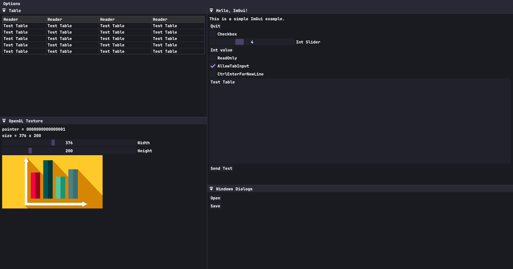
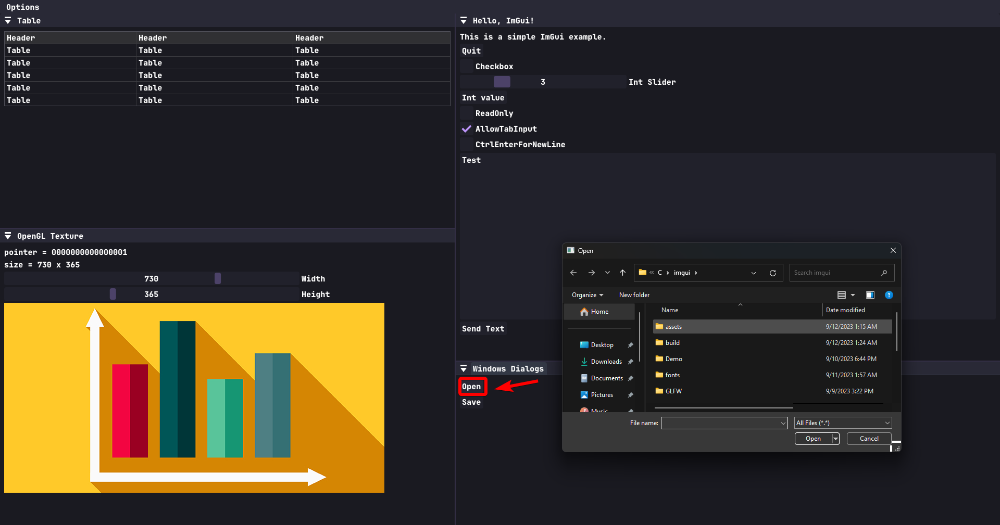

# ImGui Template

  

  

- [x] Cross Platform
- [x] Rendering Backend boiler plate
- [x] Docking
- [x] Table View
- [x] Load Images
- [x] Win32 Open File dialog
- [x] Text Input
- [x] Custom Fonts
- [x] Styles
- [x] Makefile (No Visual Studio Projects)

## To Run
* Compile : `make -j8`
* Run : `./build/Main.exe`